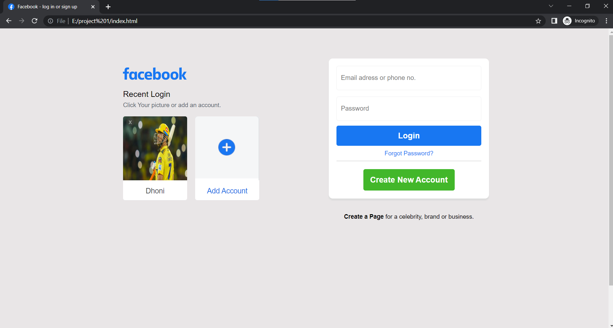

# Facebook Login Page Clone

This project is a clone of the Facebook login page built using HTML and CSS. It aims to replicate the visual appearance and layout of the original Facebook login page.

## Preview



## Features

- Responsive design: The login page is designed to adapt to different screen sizes, ensuring a seamless experience across devices.
- Form validation: The form includes basic client-side validation to ensure that the user enters valid input before submitting the form.
- Interactive buttons: The login and sign-up buttons have hover effects to provide visual feedback to the user.
- Semantic HTML structure: The HTML markup is structured using semantic elements, enhancing accessibility and search engine optimization (SEO).

## Technologies Used

- HTML
- CSS

## Getting Started

To get a local copy of the project up and running, follow these steps:

1. Clone the repository:

   ```bash
   git clone https://github.com/PankajAjmera1/facebook-login.git
   ```

2. Navigate to the project directory:

   ```bash
   cd facebook-login
   ```

3. Open the `index.html` file in your preferred web browser.

## How to Contribute

Contributions to this project are welcome. To contribute, please follow these steps:

1. Fork the repository.
2. Create a new branch.
3. Make your changes and commit them.
4. Push your changes to your forked repository.
5. Submit a pull request.


## Acknowledgements

- This project was inspired by the original Facebook login page.
- Special thanks to [OpenAI](https://openai.com/) for providing the ChatGPT model used to generate this README.